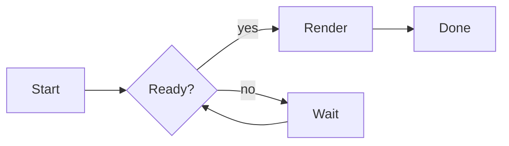
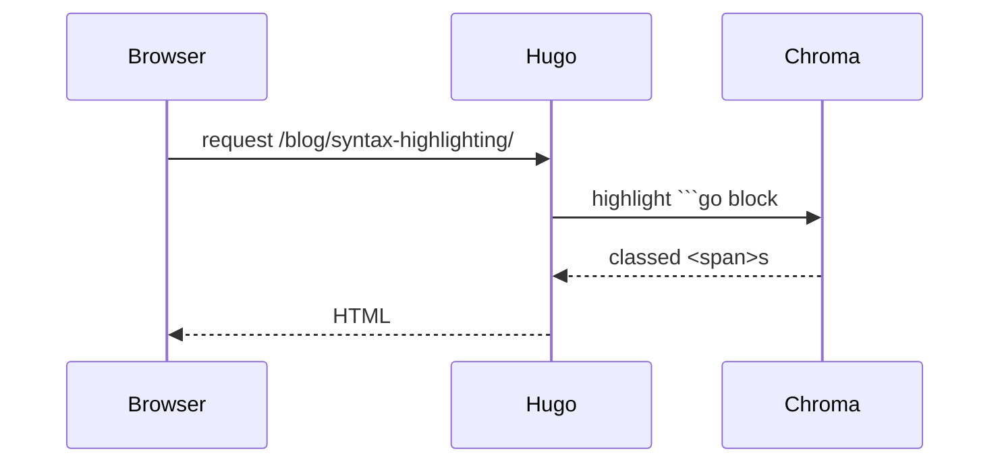
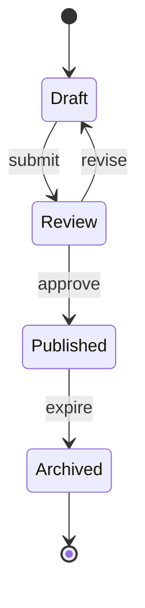
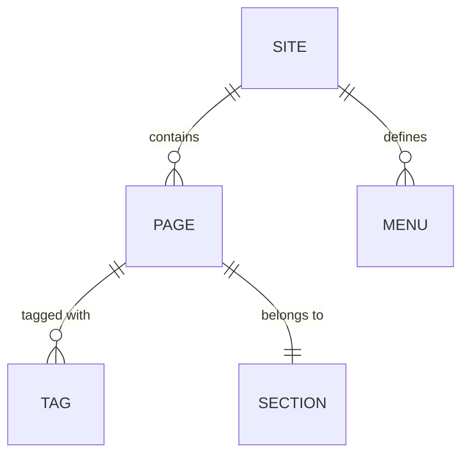
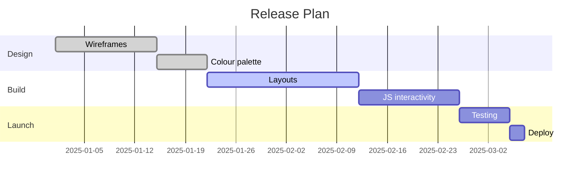

Mermaid is loaded from CDN **only on pages that use it**. The palette is
piped in from the site's base16 colorscheme, so diagrams re-theme
automatically when you swap `data/colorscheme.yaml`.

## Flowchart

## Sequence

## State

## Entity Relationship

## Gantt

